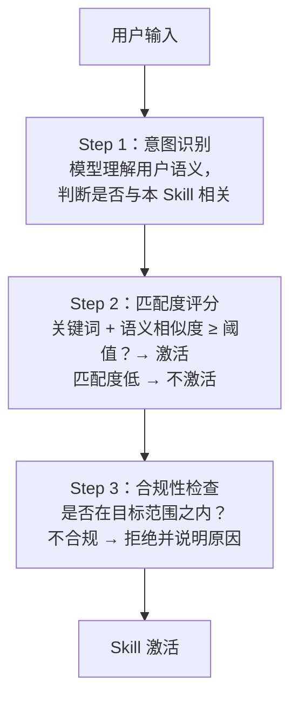

# 维度一：智能体输入（Input）

> 包括：**目标（Goal）** + 触发判断 + 数据来源
>
> 目标：我要做什么？做到什么程度？
> 监控：目标达成情况在「07-性能指标」中追踪。

---

## 目标（Goal）

每个 Skill 都应在其作业指导（SKILL.md）顶头声明目标：

```yaml
goal: >
  引导质量工程师按 VDA Volume 4 标准，逐步完成一份
  可被客户接受的 8D 报告。
scope:
  included:          # 适用范围
    - 质量问题投诉分析
    - 8D/G8D/CAPA 报告编写
  excluded:          # 边界限制
    - 人身安全、医疗诊断相关的评估
    - 需要专业资质背书的内容（如法律意见书）
```

**目标编写原则**：
- 用动词开头（"引导"、"生成"、"检查"、"转换"）
- 包含受益者（谁用、谁看）
- 可验证（完成后可被客观判断是否达成）

---

## 触发机制（Skill Activation）

### 判断流程

```

```

### 匹配度评分规则

| 加分项 | 分值 |
|--------|------|
| 精确关键词命中（"8D"、"FMEA"、"MLA"） | +0.6 |
| 语义相似度匹配 | +0.3 |
| 历史调用记录中该用户曾使用本 Skill | +0.1 |

| 得分 | 结果 |
|------|------|
| ≥ 0.7 | 激活 |
| 0.4 ~ 0.7 | 询问用户确认 |
| < 0.4 | 不激活，推荐其他 Skill |

---

## 输入来源分类

| 来源 | 说明 | 示例 |
|------|------|------|
| **用户请求** | 直接对话发起 | "帮我写一份 8D 报告" |
| **Workflow 输入** | 上游 Skill 输出 | JSON 结构化数据、PDF 提取结果 |
| **外部数据源** | 法律法规、标准、知识库、MCP 工具 | VDA Volume 4 原文、滴滴打车价格 |

---

## 输入质量要求

| 输入类型 | 最低要求 |
|----------|----------|
| 文本描述 | 非空，字符数 ≥ 10 |
| 文件 | 格式在 Skill.md 声明的范围内，可正常读取 |
| 结构化数据 | JSON/表格格式正确，包含必要字段 |

> 若输入不满足最低要求，Skill 应主动询问用户补充，而非静默失败。
