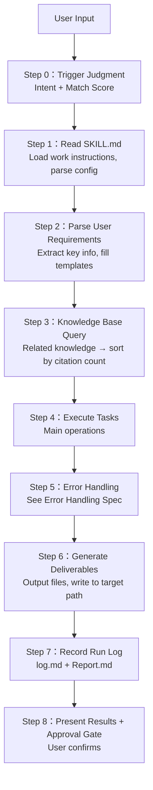

# Aspect 3: AI Agent Process Steps

> Answers: How is this Skill executed step by step? What does each step do?

---

## Execution Flow

```

```

---

## Step 0 — Trigger Judgment

See trigger mechanism in `01-input-en.md`. When match score < 0.7:
- 0.4 ~ 0.7: Ask user "Do you want to use XXX Skill to handle this request?"
- < 0.4: Inform user unable to process, recommend other Skills or general conversation

---

## Step 3 — Knowledge Base Query Specification

```
Discover related knowledge entries (> 1 entry)
    │
    ▼
Sort by citation count, high to low
    │
    ▼
Cite in order, prioritize highest-cited knowledge
    │
    ▼
[Background] Citation count for that knowledge entry +1
```

- **No relevant content in knowledge base**: Proactively acquire from external sources (web search / user provided), then record in knowledge base as new entry, marking source and date
- **External acquisition failed**: Skip that knowledge, note "Could not find relevant knowledge" in Report.md

---

## Step 5 — Error Handling Specification

### Error Levels

| Level | Definition | Handling |
|-------|-------------|----------|
| **L1 — Recoverable** | Tool call failure, retry succeeds | Auto-retry (max 3 times), record retry count |
| **L2 — Degrade Required** | Primary model unavailable, file read failed | Switch to backup model/path, continue execution |
| **L3 — Fatal** | Format error, insufficient permissions, boundary violation | Stop execution, write Error.md, inform user |

### Error Record Template (Error.md)

```markdown
# Error Record — <timestamp>

## Error Level
L<X>

## Error Description
<What specifically happened>

## Location
<Step X>: <filename/function name>

## Suspected Cause
<Why did this happen>

## Remediation Attempted
- <Action1> → Result: <success/failure>
- <Action2> → Result: <success/failure>

## Prevention Suggestion
<How to avoid similar errors in Skill.md>

## Related Log Line Numbers
<Corresponding lines in log.md>
```

---

## Memory Management Strategy

| Type | Storage Location | Update Timing | Lifecycle |
|------|-------------------|-----------------|------------|
| **Working Memory** | `<workspace>/.workbuddy/memory/YYYY-MM-DD.md` | End of each session | Valid for current day |
| **Long-term Memory** | `<workspace>/.workbuddy/memory/MEMORY.md` | Each time knowledge/decision worth persisting is discovered | Cross-session |
| **Instance Run Log** | `<instance directory>/log.md` | After each Step execution | Until task completion |

> When collaborating across sessions, the next Skill instance reads `MEMORY.md` to obtain context.
