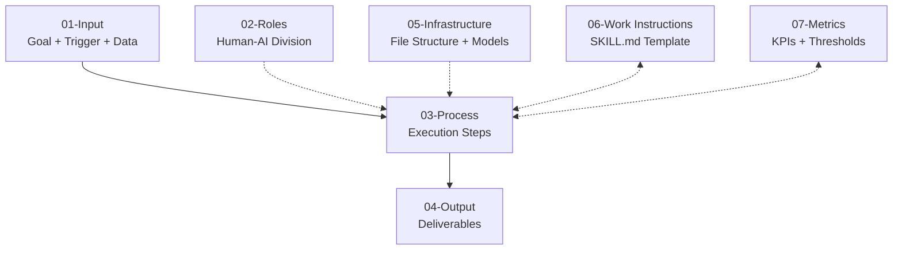

# 智能体技能模型乌龟图

> 基于 VDA 6.3 过程乌龟图七要素构建的 AI Agent / Skill 开发框架。
>
> **核心逻辑**：输入（目标）→ 角色约束 → 操作步骤 → 产出 → 基础设施（资源） → 作业指导 → 性能指标。

---

## 乌龟图（标准布局）



---

## 七维度文件清单

| 维度 | 名称 | 文件 | 说明 |
|------|------|------|------|
| **一** | 输入 | `01-input-cn.md` | 含目标（Goal）、触发判断、三类数据来源 |
| **二** | 角色 | `02-role-cn.md` | Human-AI 分工、权限矩阵、Approval Gate |
| **三** | 操作步骤 | `03-process-cn.md` | 执行流程、错误处理、内存管理 |
| **四** | 输出 | `04-output-cn.md` | 交付物分类、文件命名规范、交付流程 |
| **五** | 基础设施 | `05-infrastructure-cn.md` | 文件存储结构 + 模型接入 |
| **六** | 作业指导 | `06-work-instructions-cn.md` | SKILL.md 标准模板、版本管理、验收标准 |
| **七** | 性能指标 | `07-metrics-cn.md` | 量化基准、红黄绿阈值、改进触发机制 |

---

## 开发检查清单

新建一个 Skill 时，逐项确认：

- [ ] **维度一（输入）**：目标（Goal）已声明？触发条件已定义？匹配度阈值已设定？
- [ ] **维度二（角色）**：Human 与 AI 的分工清晰？Approval Gate 已识别？权限矩阵已声明？
- [ ] **维度三（操作步骤）**：每步可追溯？错误分级已定义？L3 错误有 Error.md 模板？
- [ ] **维度四（输出）**：交付物清单已列明？文件命名规范已定义？
- [ ] **维度五（基础设施）**：存储路径正确？模型配置已声明？MCP 工具已列出？
- [ ] **维度六（作业指导）**：SKILL.md 模板完整？版本号已分配？有验收标准？
- [ ] **维度七（性能指标）**：量化基准已设定？红黄绿阈值已定义？有改进触发机制？

---

## 生命周期状态

```
草稿（Draft）→ 评审中（Review）→ 试运行（Pilot）→ 正式发布（Active）→ 归档（Deprecated）
```

- **草稿**：SKILL.md 已编写，但未经过验证
- **评审中**：由至少 2 个不同用户测试过
- **试运行**：在真实场景中运行，有运行日志可查
- **正式发布**：经过 Pilot 验证，达到验收标准
- **归档**：被新版本替代或不再维护

---

*本框架由阿明哥基于 VDA 6.3 过程乌龟图七要素构建，适用于 AI Agent / WorkBuddy Skill 的系统化设计与评估。*
